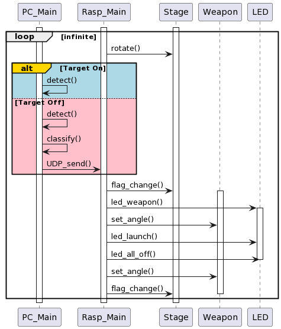
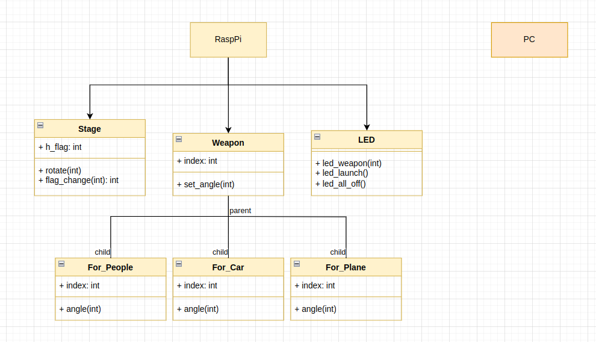

# Project BTS

* 표적 탐지 미사일 자동화 시스템
표적을 감지하여 알맞은 미사일 선택 후 올바른 각도와 세기로 격파하는 시스템

## High Level Design

- **Sequence Diagram**



- **Class Diagram**




## Clone code

```shell
git clone https://github.com/oz971124/BTS.git
```

## Prerequite

```shell
python -m venv .venv
source .venv/bin/activate
pip install -r requirements.txt
```

## Steps to build

```shell
cd ~/bts
source .venv/bin/activate

make
make install
```

## Steps to run

```shell
cd ~/bts
source .venv/bin/activate

cd /path/to/repo/xxx/
python demo.py -i xxx -m yyy -d zzz
```

## Output

* (프로젝트 실행 화면 캡쳐)


## Appendix

* (참고 자료 및 알아두어야할 사항들 기술)
